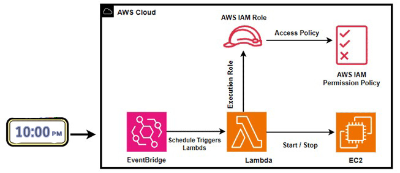

## Automating EC2 Start/Stop with AWS Lambda & EventBridge: Step-by-Step Guide
𝑇𝘩𝑖𝘴 𝘱𝑟𝘰𝑗𝘦𝑐𝘵 𝘩𝑒𝘭𝑝𝘴 𝘰𝑝𝘵𝑖𝘮𝑖𝘻𝑒 𝑐𝘭𝑜𝘶𝑑 𝑐𝘰𝑠𝘵𝑠 𝑏𝘺 𝘴ℎ𝘶𝑡𝘵𝑖𝘯𝑔 𝑑𝘰𝑤𝘯 𝘪𝑛𝘴𝑡𝘢𝑛𝘤𝑒𝘴 𝘥𝑢𝘳𝑖𝘯𝑔 𝑛𝘰𝑛-𝑤𝘰𝑟𝘬𝑖𝘯𝑔 ℎ𝘰𝑢𝘳𝑠 𝑎𝘯𝑑 𝑟𝘦𝑠𝘵𝑎𝘳𝑡𝘪𝑛𝘨 𝘵ℎ𝘦𝑚 𝑤𝘩𝑒𝘯 𝘯𝑒𝘦𝑑𝘦𝑑. 𝘛ℎ𝘦 𝘴𝑦𝘴𝑡𝘦𝑚 𝑒𝘯𝑠𝘶𝑟𝘦𝑠 𝑡𝘩𝑎𝘵 𝘌𝐶2 𝘪𝑛𝘴𝑡𝘢𝑛𝘤𝑒𝘴 𝘢𝑟𝘦 𝘴𝑡𝘰𝑝𝘱𝑒𝘥 𝘢𝑢𝘵𝑜𝘮𝑎𝘵𝑖𝘤𝑎𝘭𝑙𝘺 𝘥𝑢𝘳𝑖𝘯𝑔 𝑖𝘥𝑙𝘦 𝘱𝑒𝘳𝑖𝘰𝑑𝘴 (𝑙𝘪𝑘𝘦 𝘯𝑖𝘨ℎ𝘵𝑠 𝑜𝘳 𝘸𝑒𝘦𝑘𝘦𝑛𝘥𝑠) 𝘢𝑛𝘥 𝘴𝑡𝘢𝑟𝘵𝑒𝘥 𝘢𝑔𝘢𝑖𝘯 𝘥𝑢𝘳𝑖𝘯𝑔 𝑎𝘤𝑡𝘪𝑣𝘦 𝘩𝑜𝘶𝑟𝘴.

## Key Steps:
1.	𝐏𝐫𝐨𝐯𝐢𝐬𝐢𝐨𝐧𝐞𝐝 𝐚𝐧 𝐄𝐂𝟐 𝐈𝐧𝐬𝐭𝐚𝐧𝐜𝐞 – Created an EC2 instance to demonstrate the automation.
2.	𝐂𝐨𝐧𝐟𝐢𝐠𝐮𝐫𝐞𝐝 𝐈𝐀𝐌 𝐑𝐨𝐥𝐞 & 𝐏𝐨𝐥𝐢𝐜𝐢𝐞𝐬 – Assigned an IAM role with least-privilege permissions to allow Lambda to start/stop EC2 securely.
3.	𝐂𝐨𝐧𝐟𝐢𝐠𝐮𝐫𝐞𝐝 𝐋𝐚𝐦𝐛𝐝𝐚 𝐅𝐮𝐧𝐜𝐭𝐢𝐨𝐧 – Wrote a Python-based Lambda function to handle EC2 start/stop logic.
4.	𝐈𝐧𝐭𝐞𝐠𝐫𝐚𝐭𝐞𝐝 𝐰𝐢𝐭𝐡 𝐄𝐯𝐞𝐧𝐭𝐁𝐫𝐢𝐝𝐠𝐞 Scheduler – Set up cron-based EventBridge rules to trigger Lambda at specific times (e.g., stop at 10 PM, start at 8 AM).
5.	𝐕𝐞𝐫𝐢𝐟𝐲 𝐭𝐡𝐞 𝐋𝐚𝐦𝐛𝐝𝐚 𝐅𝐮𝐧𝐜𝐭𝐢𝐨𝐧 & 𝐄𝐯𝐞𝐧𝐭𝐁𝐫𝐢𝐝𝐠𝐞 𝐑𝐮𝐥𝐞 – Tested the workflow to confirm EC2 stops/starts as expected and verified EventBridge rule execution
	
## 💰Cost Optimization:
-	Reduce EC2 running hours by up to 70–80% during inactive times.
-	Development or testing environments that don’t need 24/7 uptime.
-	Improved operational efficiency with hands-free instance management.


## Architecture Diagram

<p align="center">
  
</p>


## Steps to Set Up

### 1. Provisioned an EC2 Instance
Launch an EC2 instance you want to manage automatically.  
Tag it appropriately (e.g., `AutoStop = true`) so the Lambda can identify it.

### 2. Configure IAM Role & Policies. 
Create Policy with existing Policy with the below policy.
Create Role and Attach the following policy to your role:

```json
{
    "Version": "2012-10-17",
    "Statement": [
        {
            "Sid": "VisualEditor0",
            "Effect": "Allow",
            "Action": [
                "ec2:Start*",
                "ec2:Stop*",
                "ec2:DescribeInstanceStatus"
            ],
            "Resource": "*"
        },
        {
            "Sid": "VisualEditor1",
            "Effect": "Allow",
            "Action": [
                "logs:CreateLogStream",
                "logs:CreateLogGroup",
                "logs:PutLogEvents"
            ],
            "Resource": "arn:aws:logs:*:*:*"
        }
    ]
}
```


### 3. Configure the AWS Lambda Function
Search for Lambda and Create a function.
Select the Runtime as Python 3.9. 
Use an existing role chooses the role we created.
Under Code, Replace the existing code with the below 

```python
import boto3
region = 'us-east-1'
instances = ['i-001e2d04e37ccde3b']
ec2 = boto3.client('ec2', region_name=region)

def lambda_handler(event, context):
    print('Stopping instances')
    ec2.stop_instances(InstanceIds=instances)
```


### 4. Integrated with EventBridge Scheduler

Use EventBridge (CloudWatch Events) to schedule Lambda invocations.

#### Example cron expressions:

| Purpose | Cron (UTC) | Description |
|----------|------------|-------------|
| Stop instances | `cron(30 16 * * ? *)` | Runs every day at **10:00 PM IST** |

*(Note: Adjust the UTC time based on your local time zone.)*

### 5. Verify the Lambda Function & EventBridge Rule 
refresh the EC2 Console and you can EC2 Instance has Stopped Automatically.


---
